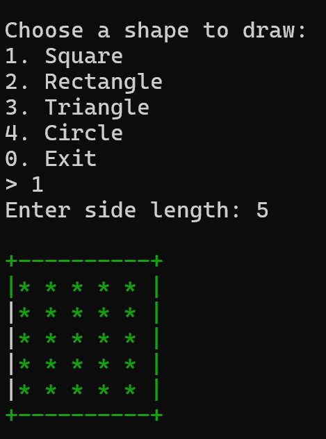
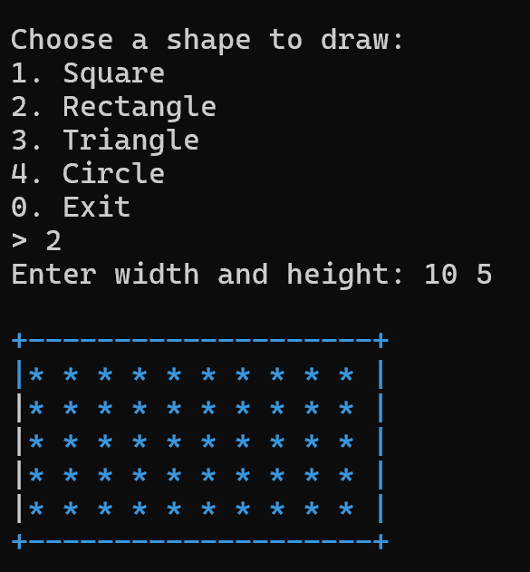
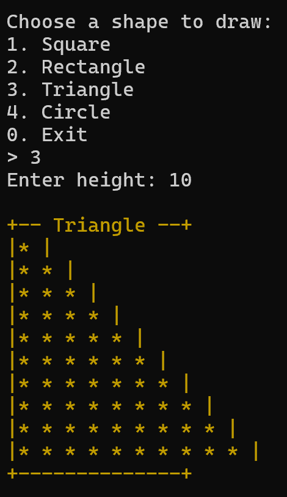
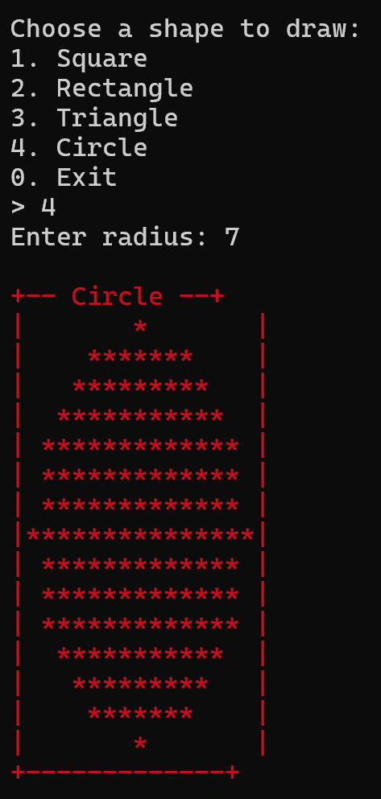

# 🟦 Console Shapes Drawer

A C++ console application that draws basic geometric shapes

🎯 **Features:**
- 🟩 Draws squares and rectangles with borders
- 🟨 Renders triangles using ASCII symbols
- 🔴 Approximates circles using console output
- 🎨 Adds color and layout using ANSI escape codes
- 🧠 Demonstrates inheritance and polymorphism

---

## 📸 Screenshots

### 🔳 Square  

### ⬛ Rectangle  

### 🔺 Triangle  

### 🔵 Circle  

